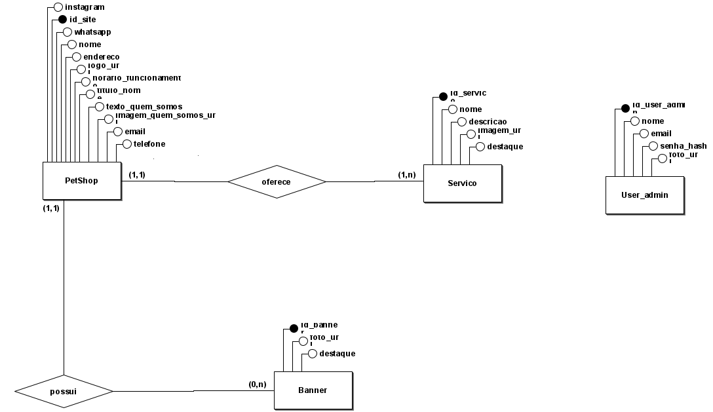
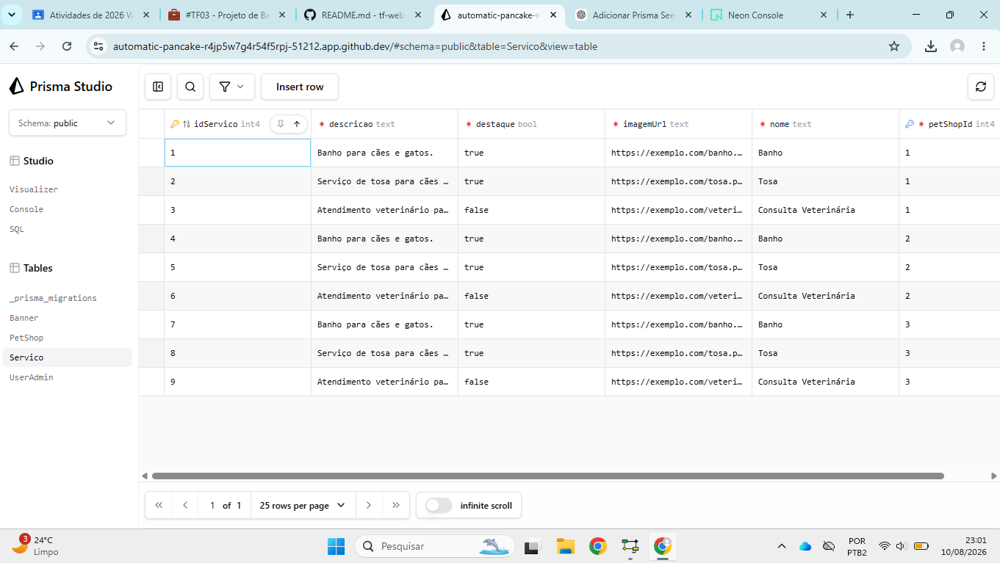

# tf-web-tema
# Periferia

### Integrantes

- Ana Cleuza Oliveira [GitHub](https://github.com/anacoliveira08)
- Ana Luiza Vieira [GitHub](https://github.com/Analuif)
- David André Santos Oliveira [GitHub](https://github.com/loucodanoite)
- Emanoel Mendes Pereira dos Santos [GitHub](https://github.com/emps1-droid)
- Erick Santos Brito [GitHub](https://github.com/erick69aaaa)

## Descrição do domínio
O Cão Guru Pet Shop é um sistema web desenvolvido para apresentar os serviços e as informações de um Pet Shop. A aplicação permite que os visitantes consultem informações sobre o estabelecimento, conheçam os serviços oferecidos e encontrem formas de contato. O sistema também possui uma área administrativa para gerenciamento do conteúdo.

## Usuários do Sistema

O sistema possui dois principais tipos de usuários:
Clientes e visitantes: acessam o sistema para consultar informações sobre o Pet Shop, conhecer os serviços oferecidos, visualizar conteúdos e encontrar formas de contato com o estabelecimento.

Administrador: responsável pelo gerenciamento das informações e conteúdos apresentados no sistema, como serviços, banners e informações do Pet Shop.
Problema que o Sistema Resolve

O projeto busca centralizar as informações do Pet Shop em um único sistema, facilitando o acesso dos clientes aos serviços oferecidos, informações sobre o estabelecimento, horários de funcionamento e formas de contato.

A área administrativa permite organizar e gerenciar os conteúdos do sistema, facilitando a atualização das informações apresentadas aos visitantes.

## Funcionalidades
- Página inicial
- Página Quem Somos
- Página de Serviços
- Página de Contato
- Área administrativa
- Gerenciamento de serviços
- Gerenciamento de contatos
- Navegação entre páginas

[Figma](https://www.figma.com/design/1tANrlXU47wY134RZm9iSN/Wireframe?node-id=0-1&t=KVeiEHdL2CaC1QhB-1)

## Modelo Conceitual

### Entidades

**PetShop:** representa o estabelecimento que utiliza o sistema. Possui os atributos `idSite`, `instagram`, `whatsapp`, `nome`, `endereco`, `logoUrl`, `horarioFuncionamento`, `tituloHome`, `textoQuemSomos`, `imagemQuemSomosUrl`, `email` e `telefone`. Esses atributos existem para armazenar os dados de identificação, contato, localização, funcionamento e informações institucionais do Pet Shop que serão apresentados no site.

**Servico:** representa os serviços oferecidos pelo Pet Shop, como banho, tosa e consulta veterinária. Possui os atributos `idServico`, `nome`, `descricao`, `imagemUrl`, `destaque` e `petShopId`. O `nome` identifica o serviço, `descricao` apresenta suas características, `imagemUrl` armazena sua imagem, `destaque` indica se o serviço deve receber destaque no site e `petShopId` identifica o Pet Shop ao qual o serviço pertence.

**Banner:** representa os banners utilizados para apresentar conteúdos visuais no site. Possui os atributos `idBanner`, `fotoUrl`, `destaque` e `petShopId`. O `fotoUrl` armazena a imagem do banner, `destaque` indica se ele deve ser destacado na apresentação do site e `petShopId` identifica o Pet Shop relacionado ao banner.

**UserAdmin:** representa o usuário responsável pela administração do sistema. Possui os atributos `idUserAdmin`, `nome`, `email`, `senhaHash` e `fotoUrl`. O `nome` identifica o administrador, `email` é utilizado para sua identificação e acesso, `senhaHash` armazena a senha de forma protegida e `fotoUrl` permite armazenar uma imagem do administrador.

### Relacionamentos e Cardinalidades

**PetShop e Servico:** um PetShop pode possuir vários Serviços, enquanto cada Serviço pertence a um único PetShop. Portanto, o relacionamento possui cardinalidade **1:N (um para muitos)**. O campo `petShopId` na entidade `Servico` representa a chave estrangeira que identifica o PetShop ao qual o serviço pertence.

**PetShop e Banner:** um PetShop pode possuir vários Banners, enquanto cada Banner pertence a um único PetShop. Portanto, o relacionamento possui cardinalidade **1:N (um para muitos)**. O campo `petShopId` na entidade `Banner` representa a chave estrangeira que identifica o PetShop relacionado.

**UserAdmin:** a entidade UserAdmin representa os administradores responsáveis pelo gerenciamento do sistema. No modelo atual, não existe um relacionamento direto entre `UserAdmin` e as demais entidades, pois o administrador atua sobre o gerenciamento do conteúdo do sistema e não precisa ser associado diretamente a um PetShop, Serviço ou Banner no banco de dados.

### Modelo Lógico

[prisma/schema.prisma](prisma/schema.prisma)

### Modelo Físico 

[prisma/seed.js](prisma/seed.js)

### Evidência Funcional

